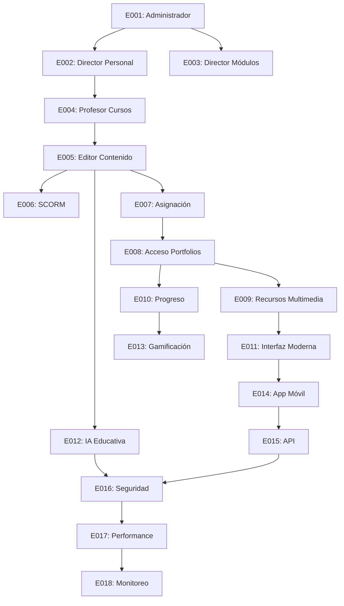

# Plan de Releases - Sistema Educativo

## 🎯 Visión General del Roadmap

El desarrollo del Sistema Educativo está planificado en **3 releases principales** distribuidos a lo largo de **21 sprints (10.5 meses)**, priorizando funcionalidades core, experiencia educativa y capacidades avanzadas.

## 📅 Cronograma de Releases

### **Release 1.0: MVP Educativo** 
**Fecha objetivo**: Mayo 2025  
**Duración**: 9 sprints (4.5 meses)  
**Story Points**: 522 SP  

### **Release 2.0: Plataforma Completa**
**Fecha objetivo**: Septiembre 2025  
**Duración**: 8 sprints (4 meses)  
**Story Points**: 542 SP  

### **Release 3.0: Sistema Empresarial**
**Fecha objetivo**: Noviembre 2025  
**Duración**: 4 sprints (2 meses)  
**Story Points**: 333 SP  

---

## 🚀 Release 1.0: MVP Educativo

### **Objetivo Principal**
Establecer la **base funcional** del sistema con capacidades esenciales para profesores y estudiantes, incluyendo el potente editor modular de contenido.

### **Épicas Incluidas**

| Sprint | Épica | Story Points | Dependencias | Estado |
|--------|-------|--------------|--------------|--------|
| **S1-S3** | EPICA-E001: Gestión Integral del Director | 55 SP | Ninguna | 🟡 Planificado |
| **S2-S4** | EPICA-E002: Gestión de Personal Docente | 89 SP | E001 | 🟡 Planificado |
| **S3-S4** | EPICA-E003: Control de Módulos Pedagógicos | 34 SP | E001, E002 | 🟡 Planificado |
| **S4-S6** | EPICA-E004: Administración de Cursos | 89 SP | E002 | 🟡 Planificado |
| **S5-S9** | EPICA-E005: Editor de Contenido Personalizado | 144 SP | E004 | 🟡 Planificado |
| **S7-S8** | EPICA-E006: Paquetes SCORM | 55 SP | E005 | 🟡 Planificado |
| **S8-S9** | EPICA-E007: Asignación de Materiales | 55 SP | E005 | 🟡 Planificado |

### **Funcionalidades Clave del MVP**
✅ **Sistema de Usuarios Completo**
- Autenticación con Google OAuth 2.0
- Roles granulares (Administrador, Director, Profesor, Estudiante)
- Perfiles personalizables por rol

✅ **Gestión Administrativa**
- Dashboard del administrador para gestión integral
- Herramientas del director para personal y módulos
- Control de acceso y permisos

✅ **Gestión Académica**
- Creación y administración de cursos
- Asignación de profesores y estudiantes
- Estructura de materias y secciones

✅ **Editor Modular Avanzado** ⭐
- 4 módulos especializados (39+ herramientas)
- Subida de multimedia hasta 50MB
- Herramientas de IA integradas
- Interfaz descriptiva para profesores

✅ **Contenido SCORM**
- Importación de paquetes educativos estándar
- Compatibilidad con herramientas externas
- Seguimiento de progreso SCORM

### **Criterios de Éxito Release 1.0**
- [ ] 100% épicas E001-E007 completadas
- [ ] Sistema desplegado en Azure
- [ ] >95% tests passing
- [ ] Performance: carga inicial <3 segundos
- [ ] 10+ profesores piloto usando el editor
- [ ] Feedback inicial >4.0/5

---

## 📚 Release 2.0: Plataforma Completa

### **Objetivo Principal**
Completar la **experiencia educativa** con funcionalidades para estudiantes, análisis avanzado y capacidades móviles.

### **Épicas Incluidas**

| Sprint | Épica | Story Points | Dependencias | Estado |
|--------|-------|--------------|--------------|--------|
| **S9-S10** | EPICA-E008: Acceso a Portfolios | 55 SP | E007 | 🟡 Planificado |
| **S10-S12** | EPICA-E009: Recursos Multimedia | 89 SP | E008 | 🟡 Planificado |
| **S11-S12** | EPICA-E010: Progreso y Tareas | 55 SP | E008, E009 | 🟡 Planificado |
| **S12-S14** | EPICA-E011: Interfaz Moderna | 89 SP | E008-E010 | 🟡 Planificado |
| **S13-S17** | EPICA-E012: IA Educativa | 144 SP | E005 | 🟡 Planificado |
| **S15-S16** | EPICA-E013: Gamificación | 55 SP | E010 | 🟢 Opcional |
| **S16-S18** | EPICA-E014: App Móvil | 89 SP | E011 | 🟡 Planificado |
| **S17-S18** | EPICA-E015: API e Integraciones | 55 SP | E014 | 🟡 Planificado |

### **Funcionalidades Clave Release 2.0**
✅ **Experiencia del Estudiante**
- Dashboard personalizado por materia
- Navegación jerárquica por temas
- Sistema de favoritos y marcadores
- Visualización detallada de progreso

✅ **Contenido Multimedia Rico**
- Reproductor avanzado de videos
- Soporte para múltiples formatos
- Descarga offline de materiales
- Sincronización automática

✅ **Seguimiento y Evaluación**
- Tracking detallado de progreso
- Calendarios de tareas y entregas
- Métricas de tiempo dedicado
- Comparación con compañeros

✅ **Interfaz Moderna y Adaptativa**
- Diseño responsive optimizado
- Progressive Web App (PWA)
- Modo offline para estudiantes
- Accesibilidad WCAG 2.1 AA

✅ **Inteligencia Artificial Avanzada** ⭐
- Generación automática de contenido
- Sugerencias personalizadas
- Análisis de calidad pedagógica
- Adaptación de nivel educativo

✅ **Gamificación**
- Sistema de puntos y logros
- Competencias saludables
- Racha de días consecutivos
- Desafíos colaborativos

✅ **Aplicación Móvil**
- App nativa iOS/Android
- Notificaciones push
- Sincronización en tiempo real
- Modo offline robusto

### **Criterios de Éxito Release 2.0**
- [ ] 100% épicas E008-E015 completadas
- [ ] >500 estudiantes activos
- [ ] >80% adopción móvil
- [ ] Tiempo promedio sesión >20 minutos
- [ ] Satisfacción estudiantes >4.2/5
- [ ] IA genera >40% del contenido nuevo

---

## 🏢 Release 3.0: Sistema Empresarial

### **Objetivo Principal**
Implementar **infraestructura empresarial** con seguridad avanzada, performance optimizado y observabilidad completa.

### **Épicas Incluidas**

| Sprint | Épica | Story Points | Dependencias | Estado |
|--------|-------|--------------|--------------|--------|
| **S14-S17** | EPICA-E016: Seguridad y Compliance | 89 SP | Todas previas | 🟡 Planificado |
| **S18-S19** | EPICA-E017: Performance y Escalabilidad | 55 SP | E016 | 🟡 Planificado |
| **S19-S21** | EPICA-E018: Monitoreo y Analíticas | 89 SP | E017 | 🟡 Planificado |

### **Funcionalidades Clave Release 3.0**
✅ **Seguridad Empresarial**
- Cumplimiento GDPR y COPPA
- Auditoría completa de acciones
- Encriptación end-to-end
- Single Sign-On (SSO)
- Autenticación multifactor

✅ **Performance y Escalabilidad**
- Optimización de base de datos
- CDN global para multimedia
- Caching inteligente multicapa
- Auto-scaling en Azure
- Load balancing avanzado

✅ **Monitoreo y Observabilidad**
- Dashboard ejecutivo en tiempo real
- Métricas educativas avanzadas
- Alertas predictivas
- Análisis de comportamiento
- Reportes automatizados

### **Criterios de Éxito Release 3.0**
- [ ] Certificación de seguridad completa
- [ ] Performance: <500ms response time
- [ ] Escalabilidad: 10,000+ usuarios concurrentes
- [ ] Uptime: >99.9%
- [ ] Compliance: 100% auditorías pasadas

---

## 🔄 Gestión de Dependencias

### **Dependencias Críticas**

### **Riesgos y Mitigación**

| Riesgo | Probabilidad | Impacto | Mitigación |
|--------|--------------|---------|------------|
| **Complejidad Editor E005** | Media | Alto | Desarrollo incremental, testing continuo |
| **Integración IA E012** | Media | Medio | Prototipo temprano, Azure OpenAI estable |
| **Performance E017** | Baja | Alto | Monitoring desde MVP, optimización gradual |
| **Dependencias externas** | Media | Medio | APIs mock, desarrollo en paralelo |

---

## 📊 Métricas de Seguimiento por Release

### **Release 1.0 KPIs**
- **Funcionalidad**: 100% épicas completadas
- **Calidad**: >90% cobertura tests
- **Performance**: <3s carga inicial
- **Adopción**: 10+ profesores piloto

### **Release 2.0 KPIs**
- **Usuarios**: 500+ estudiantes activos
- **Engagement**: >20min sesión promedio
- **Mobile**: >40% accesos móviles
- **IA**: >40% contenido generado

### **Release 3.0 KPIs**
- **Escalabilidad**: 10,000+ usuarios concurrentes
- **Seguridad**: 100% auditorías passed
- **Performance**: <500ms response time
- **Uptime**: >99.9%

---

## 🎯 Criterios de Go/No-Go por Release

### **Release 1.0 → 2.0**
✅ **Go Criteria:**
- [ ] MVP funcional al 100%
- [ ] Feedback profesores >4.0/5
- [ ] Performance targets alcanzados
- [ ] Zero critical bugs

❌ **No-Go Triggers:**
- Editor modular no funcional
- Problemas críticos de seguridad
- Performance inaceptable
- Feedback negativo masivo

### **Release 2.0 → 3.0**
✅ **Go Criteria:**
- [ ] Experiencia estudiante completa
- [ ] Mobile app funcional
- [ ] IA integrada correctamente
- [ ] Base de usuarios creciendo

❌ **No-Go Triggers:**
- Problemas de escalabilidad
- IA no cumple expectativas
- App móvil inestable
- Retención estudiantes baja

---

## 📈 Plan de Comunicación

### **Stakeholders por Release**

**Release 1.0**: Equipo desarrollo, directores, profesores piloto
**Release 2.0**: Estudiantes, padres, comunidad educativa
**Release 3.0**: Administradores, IT, inversores

### **Canales de Comunicación**
- **Weekly sprints**: Scrum ceremonies
- **Monthly demos**: Stakeholder reviews
- **Release announcements**: Email, website, social media
- **Training sessions**: Pre-release para usuarios

Este plan de releases garantiza un desarrollo **incremental y controlado** hacia un sistema educativo completo y robusto. 