# Arquitectura Física en Azure - Sistema Educativo
## Proyecto de Investigación

Este documento describe la arquitectura física del Sistema Educativo desplegado en Microsoft Azure, optimizada para un **proyecto de investigación** con consideraciones de costo, escalabilidad y rendimiento.

## Visión General de la Arquitectura

La arquitectura utiliza servicios de Azure en configuraciones económicas pero escalables, aprovechando créditos académicos y tiers básicos para mantener costos controlados mientras proporciona un ambiente robusto de producción.

## Diagrama de Arquitectura Física

```mermaid
graph TB
    subgraph "Internet"
        Users["👥 Usuarios<br/>Director, Profesores, Estudiantes"]
        CDN["🌐 Azure CDN<br/>Standard Microsoft<br/>Multimedia & Assets"]
    end

    subgraph "Azure Resource Group - Sistema Educativo"
        subgraph "Frontend & Load Balancing"
            AppGateway["🛡️ Azure Application Gateway<br/>SSL Termination + WAF<br/>Standard_v2 (Small)"]
        end

        subgraph "Compute Layer"
            AppService["🖥️ Azure App Service<br/>Django Application<br/>B2 (Basic Plan)<br/>Linux + Python 3.11"]
            
            ContainerGroup["📦 Azure Container Instances<br/>Celery Workers<br/>B2s (2 vCPU, 4GB RAM)<br/>Background Tasks"]
        end

        subgraph "Data Layer"
            PostgreSQL["🗄️ Azure Database PostgreSQL<br/>Flexible Server<br/>Burstable B2s (2 vCPU, 4GB)<br/>100GB Storage"]
            
            Redis["⚡ Azure Cache for Redis<br/>Basic C1 (1GB)<br/>Session & Celery Broker"]
        end

        subgraph "Storage Layer"
            BlobStorage["💾 Azure Blob Storage<br/>Hot Tier<br/>Multimedia Files (50MB max)<br/>LRS Redundancy"]
            
            FileShare["📁 Azure Files<br/>Standard LRS<br/>Static Files & Backups"]
        end

        subgraph "Monitoring & DevOps"
            AppInsights["📊 Application Insights<br/>Performance Monitoring<br/>Error Tracking"]
            
            LogAnalytics["📝 Log Analytics<br/>Centralized Logging<br/>Query & Alerts"]
            
            KeyVault["🔐 Azure Key Vault<br/>Secrets Management<br/>API Keys & Credentials"]
        end

        subgraph "AI Services"
            OpenAI["🤖 Azure OpenAI Service<br/>GPT-4 Model<br/>Content Generation<br/>Pay-per-use"]
        end
    end

    subgraph "External Services"
        GoogleOAuth["🔑 Google OAuth 2.0<br/>Authentication Provider"]
        GitHub["📚 GitHub<br/>Source Code Repository<br/>CI/CD Actions"]
    end

    %% User Flow
    Users --> CDN
    Users --> AppGateway
    
    %% Load Balancing
    AppGateway --> AppService
    
    %% Application Connections
    AppService --> PostgreSQL
    AppService --> Redis
    AppService --> BlobStorage
    AppService --> FileShare
    AppService --> OpenAI
    AppService --> GoogleOAuth
    
    %% Background Processing
    ContainerGroup --> PostgreSQL
    ContainerGroup --> Redis
    ContainerGroup --> BlobStorage
    ContainerGroup --> OpenAI
    
    %% CDN Sources
    CDN --> BlobStorage
    CDN --> FileShare
    
    %% Monitoring
    AppService --> AppInsights
    ContainerGroup --> AppInsights
    AppInsights --> LogAnalytics
    
    %% Security
    AppService --> KeyVault
    ContainerGroup --> KeyVault
    
    %% DevOps
    GitHub --> AppService
```



## Especificaciones Técnicas por Componente

### 🖥️ **Capa de Computación**

#### **Azure App Service - Aplicación Django**
- **SKU**: B2 (Basic Plan)
- **Recursos**: 2 vCPU, 3.5GB RAM
- **SO**: Linux (Ubuntu 20.04)
- **Runtime**: Python 3.11
- **Auto-scaling**: Deshabilitado (manual para control de costos)
- **Costo estimado**: ~$55 USD/mes

**Configuración:**
```yaml
# azure-pipelines.yml
app_service:
  name: sistema-educativo-app
  plan: B2
  runtime: PYTHON|3.11
  environment_variables:
    DJANGO_SETTINGS_MODULE: "proyecto.settings.production"
    DATABASE_URL: "$(POSTGRESQL_CONNECTION_STRING)"
    REDIS_URL: "$(REDIS_CONNECTION_STRING)"
    AZURE_STORAGE_ACCOUNT: "$(STORAGE_ACCOUNT_NAME)"
```

#### **Azure Container Instances - Celery Workers**
- **SKU**: B2s (2 vCPU, 4GB RAM)
- **Instancias**: 2 containers (worker + beat)
- **Auto-restart**: Habilitado
- **Red**: VNet integrada con App Service
- **Costo estimado**: ~$65 USD/mes

**Docker Configuration:**
```dockerfile
# Dockerfile.celery
FROM python:3.11-slim
COPY requirements.txt .
RUN pip install -r requirements.txt
COPY . /app
WORKDIR /app
CMD ["celery", "-A", "proyecto", "worker", "-l", "info"]
```

### 🗄️ **Capa de Datos**

#### **Azure Database for PostgreSQL - Flexible Server**
- **SKU**: Burstable B2s (2 vCPU, 4GB RAM)
- **Storage**: 100GB SSD (escalable hasta 16TB)
- **Backup**: 7 días de retención
- **Alta disponibilidad**: Zona única (para reducir costos)
- **SSL**: Requerido
- **Costo estimado**: ~$95 USD/mes

**Configuración de conexión:**
```python
# settings/production.py
DATABASES = {
    'default': {
        'ENGINE': 'django.db.backends.postgresql',
        'HOST': 'sistema-educativo-db.postgres.database.azure.com',
        'PORT': '5432',
        'OPTIONS': {
            'sslmode': 'require',
        },
    }
}
```

#### **Azure Cache for Redis**
- **SKU**: Basic C1 (1GB)
- **TLS**: Habilitado
- **Persistencia**: Habilitada
- **Uso**: Sessions, Celery broker, Cache de aplicación
- **Costo estimado**: ~$20 USD/mes

### 💾 **Capa de Almacenamiento**

#### **Azure Blob Storage - Multimedia Files**
- **Tier**: Hot (acceso frecuente)
- **Redundancia**: LRS (Locally Redundant Storage)
- **Capacidad estimada**: 500GB (archivos hasta 50MB)
- **CDN**: Integrado con Azure CDN
- **Lifecycle management**: Archivos antiguos a Cool tier (90 días)
- **Costo estimado**: ~$25 USD/mes

**Estructura de containers:**
```
multimedia-assets/
├── images/
│   ├── original/
│   ├── thumbnails/
│   └── compressed/
├── videos/
│   ├── original/
│   └── transcoded/
├── audio/
│   ├── original/
│   └── compressed/
└── documents/
    └── scorm-packages/
```

#### **Azure Files - Static Files & Backups**
- **Tier**: Standard LRS
- **Capacidad**: 100GB
- **Uso**: Static files, backups, shared storage
- **Protocolos**: SMB 3.0, REST
- **Costo estimado**: ~$15 USD/mes

### 🛡️ **Capa de Seguridad y Networking**

#### **Azure Application Gateway**
- **SKU**: Standard_v2 (Small)
- **WAF**: Habilitado (OWASP ruleset)
- **SSL**: Certificado gestionado por Azure
- **Backend pools**: App Service
- **Health probes**: Configurados para /health/
- **Costo estimado**: ~$35 USD/mes

#### **Azure Key Vault**
- **SKU**: Standard
- **Secrets**: API keys, connection strings, certificates
- **Access policies**: Managed Identity
- **Audit logging**: Habilitado
- **Costo estimado**: ~$3 USD/mes

### 🌐 **CDN y Distribución**

#### **Azure CDN - Standard Microsoft**
- **Points of presence**: Global
- **Origin**: Blob Storage + App Service
- **Caching rules**: Personalizadas por tipo de archivo
- **Compression**: Habilitada para JS, CSS, HTML
- **Costo estimado**: ~$10 USD/mes (tráfico bajo)

**Configuración de caching:**
```yaml
# CDN Rules
static_files:
  pattern: "*.css, *.js, *.png, *.jpg"
  cache_duration: "1 day"
  
multimedia:
  pattern: "/media/*"
  cache_duration: "7 days"
  
api_responses:
  pattern: "/api/*"
  cache_duration: "5 minutes"
```

### 🤖 **Servicios de IA**

#### **Azure OpenAI Service**
- **Model**: GPT-4 (128K context)
- **Deployment**: Standard
- **Rate limits**: 10K tokens/minute
- **Pricing**: Pay-per-use ($0.03/1K tokens)
- **Estimated cost**: ~$50 USD/mes (uso moderado)

**Integration code:**
```python
# services/openai_service.py
from azure.ai.openai import OpenAIClient
from azure.identity import DefaultAzureCredential

client = OpenAIClient(
    endpoint="https://sistema-educativo-openai.openai.azure.com/",
    credential=DefaultAzureCredential()
)
```

### 📊 **Monitoreo y Observabilidad**

#### **Application Insights**
- **SKU**: Basic
- **Retention**: 90 días
- **Telemetry**: Performance, exceptions, dependencies
- **Custom metrics**: User engagement, content generation
- **Alertas**: Error rate, response time
- **Costo estimado**: ~$15 USD/mes

#### **Log Analytics Workspace**
- **Retention**: 30 días
- **Data sources**: App Service, Container Instances, PostgreSQL
- **Queries**: KQL para análisis
- **Dashboards**: Personalizados por rol
- **Costo estimado**: ~$10 USD/mes

## Configuración de Red y Seguridad

### **Virtual Network Configuration**
```yaml
vnet:
  name: sistema-educativo-vnet
  address_space: 10.0.0.0/16
  subnets:
    - name: app-subnet
      address_prefix: 10.0.1.0/24
      services: [App Service, Container Instances]
    - name: data-subnet  
      address_prefix: 10.0.2.0/24
      services: [PostgreSQL, Redis]
    - name: gateway-subnet
      address_prefix: 10.0.3.0/24
      services: [Application Gateway]
```

### **Security Groups (NSG)**
```yaml
app_nsg:
  inbound_rules:
    - name: HTTPS
      port: 443
      source: Application Gateway
    - name: SSH
      port: 22
      source: Management subnet
      
data_nsg:
  inbound_rules:
    - name: PostgreSQL
      port: 5432
      source: App subnet
    - name: Redis
      port: 6379
      source: App subnet
```

## Estrategia de Backup y Disaster Recovery

### **Backup Configuration**
```yaml
backup_strategy:
  database:
    type: Azure Database Backup
    frequency: Daily
    retention: 7 days
    geo_redundant: false # Para reducir costos
    
  blob_storage:
    type: Azure Backup
    frequency: Weekly
    retention: 4 weeks
    
  application:
    type: GitHub + Container Registry
    frequency: On commit
    retention: Indefinite
```

### **Disaster Recovery Plan**
- **RTO (Recovery Time Objective)**: 4 horas
- **RPO (Recovery Point Objective)**: 24 horas
- **Procedure**: Documentado en runbook
- **Testing**: Trimestral

## Estimación de Costos Mensual

| Servicio | SKU/Plan | Costo USD/mes |
|----------|----------|---------------|
| **App Service** | B2 (2 vCPU, 3.5GB) | $55 |
| **Container Instances** | B2s x2 instances | $65 |
| **PostgreSQL** | Burstable B2s (4GB) | $95 |
| **Redis Cache** | Basic C1 (1GB) | $20 |
| **Blob Storage** | Hot LRS (500GB) | $25 |
| **Azure Files** | Standard LRS (100GB) | $15 |
| **Application Gateway** | Standard_v2 Small | $35 |
| **Azure CDN** | Standard Microsoft | $10 |
| **Key Vault** | Standard | $3 |
| **Application Insights** | Basic | $15 |
| **Log Analytics** | Basic | $10 |
| **Azure OpenAI** | GPT-4 Pay-per-use | $50 |
| **Network & Misc** | VNet, NSG, DNS | $15 |
| **TOTAL ESTIMADO** | | **$413 USD/mes** |

### **Optimizaciones para Investigación**
- **Azure for Students**: $100 USD créditos mensuales
- **Azure Research Grant**: Hasta $1000 USD adicionales
- **Dev/Test pricing**: 40% descuento en compute
- **Reserved Instances**: 30% descuento (comprometer 1 año)

**Costo optimizado para investigación**: ~$250 USD/mes

## Configuración de CI/CD con GitHub Actions

### **Pipeline de Deployment**
```yaml
# .github/workflows/azure-deploy.yml
name: Deploy to Azure
on:
  push:
    branches: [main]

jobs:
  build-and-deploy:
    runs-on: ubuntu-latest
    steps:
    - uses: actions/checkout@v3
    
    - name: Setup Python
      uses: actions/setup-python@v4
      with:
        python-version: '3.11'
        
    - name: Build application
      run: |
        pip install -r requirements.txt
        python manage.py collectstatic --noinput
        
    - name: Deploy to Azure App Service
      uses: azure/webapps-deploy@v2
      with:
        app-name: sistema-educativo-app
        publish-profile: ${{ secrets.AZURE_WEBAPP_PUBLISH_PROFILE }}
        
    - name: Update Container Instances
      run: |
        az container restart --name celery-workers \
          --resource-group sistema-educativo-rg
```

## Environment Configuration

### **Production Settings**
```python
# settings/production.py
import os
from azure.identity import DefaultAzureCredential
from azure.keyvault.secrets import SecretClient

# Key Vault integration
credential = DefaultAzureCredential()
client = SecretClient(
    vault_url="https://sistema-educativo-kv.vault.azure.net/",
    credential=credential
)

# Database
DATABASES = {
    'default': {
        'ENGINE': 'django.db.backends.postgresql',
        'HOST': client.get_secret("database-host").value,
        'NAME': client.get_secret("database-name").value,
        'USER': client.get_secret("database-user").value,
        'PASSWORD': client.get_secret("database-password").value,
        'PORT': '5432',
        'OPTIONS': {'sslmode': 'require'},
    }
}

# Redis
REDIS_URL = client.get_secret("redis-connection-string").value

# Storage
DEFAULT_FILE_STORAGE = 'storages.backends.azure_storage.AzureStorage'
AZURE_ACCOUNT_NAME = client.get_secret("storage-account-name").value
AZURE_ACCOUNT_KEY = client.get_secret("storage-account-key").value
AZURE_CONTAINER = 'multimedia-assets'

# OpenAI
OPENAI_API_BASE = client.get_secret("openai-endpoint").value
OPENAI_API_KEY = client.get_secret("openai-api-key").value
```

### **Environment Variables**
```bash
# App Service Configuration
DJANGO_SETTINGS_MODULE=proyecto.settings.production
AZURE_CLIENT_ID=<managed-identity-id>
PYTHONPATH=/home/site/wwwroot
```

## Monitoreo y Alertas

### **Application Insights Queries**
```kusto
// Performance monitoring
requests
| where timestamp > ago(1h)
| summarize avg(duration), count() by name
| order by avg_duration desc

// Error tracking  
exceptions
| where timestamp > ago(24h)
| summarize count() by type, outerMessage
| order by count_ desc

// User engagement
customEvents
| where name == "ContentGenerated"
| summarize count() by bin(timestamp, 1h)
```

### **Alertas Configuradas**
- **Error rate** > 5% en 5 minutos
- **Response time** > 3 segundos promedio
- **Database CPU** > 80% por 10 minutos
- **Storage** > 90% de capacidad
- **OpenAI quota** > 80% del límite mensual

## Procedimientos Operacionales

### **Deployment Checklist**
1. ✅ Run tests locally
2. ✅ Update requirements.txt
3. ✅ Database migrations
4. ✅ Static files collection
5. ✅ Environment variables verification
6. ✅ Health check post-deployment
7. ✅ Monitor error rates

### **Maintenance Windows**
- **Scheduled**: Domingos 2:00-4:00 AM UTC
- **Emergency**: 24/7 on-call rotation
- **Notifications**: Email + Teams integration

### **Scale-out Strategy**
```yaml
scaling_triggers:
  cpu_threshold: 70%
  memory_threshold: 80%
  response_time: 2000ms
  
scaling_actions:
  app_service: Upgrade to P1v2
  database: Upgrade to GP_Gen5_2
  containers: Add worker instances
  storage: Enable geo-replication
```

## Consideraciones de Investigación

### **Data Collection & Analytics**
- **User behavior**: Application Insights custom events
- **Performance metrics**: Response times, throughput
- **Content quality**: AI-generated content feedback
- **Educational efficacy**: Student progress tracking

### **Research Data Export**
```python
# analytics/data_export.py
def export_research_data():
    """Export anonymized data for research analysis"""
    return {
        'user_interactions': get_anonymized_interactions(),
        'content_generation_metrics': get_ai_metrics(),
        'performance_data': get_performance_metrics(),
        'educational_outcomes': get_learning_outcomes()
    }
```

### **Compliance & Privacy**
- **GDPR**: Data anonymization for research
- **COPPA**: Student data protection
- **Azure compliance**: SOC 2, ISO 27001
- **Data residency**: Configurable por región

## Conclusión

Esta arquitectura física en Azure está diseñada específicamente para un **proyecto de investigación**, balanceando:

### ✅ **Beneficios Clave:**
1. **Costo controlado**: ~$250 USD/mes con créditos académicos
2. **Escalabilidad**: Fácil upgrade de componentes
3. **Observabilidad**: Monitoreo completo para investigación
4. **Seguridad**: WAF, Key Vault, SSL/TLS
5. **Alta disponibilidad**: 99.9% SLA en componentes críticos
6. **CI/CD**: Deployment automatizado
7. **Backup/DR**: Protección de datos de investigación

### 🎯 **Optimizado para:**
- **Desarrollo académico** con recursos limitados
- **Investigación educativa** con recolección de métricas
- **Escalamiento futuro** según crecimiento del proyecto
- **Colaboración** con equipos distribuidos
- **Experimentación** con nuevas funcionalidades

Esta arquitectura proporciona una **base sólida y económica** para el desarrollo del Sistema Educativo como proyecto de investigación, con capacidad de evolucionar hacia un ambiente de producción completo según los resultados y necesidades del proyecto. 