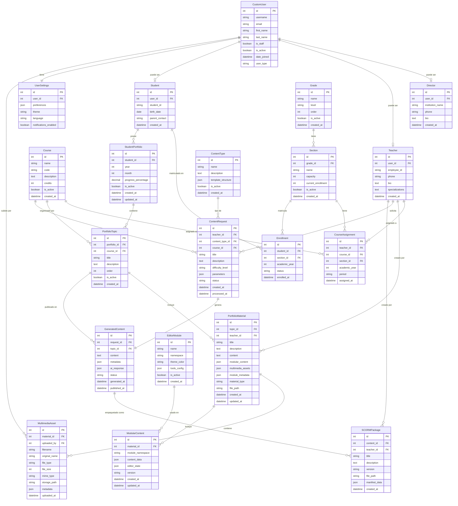

# Diagrama de Base de Datos - Sistema Educativo

## Visión General

Este diagrama muestra la estructura completa de la base de datos del Sistema Educativo, incluyendo todas las entidades, relaciones y los nuevos campos implementados para el **Sistema Modular de Edición de Contenido** y **gestión multimedia avanzada**.

## Estructura por Módulos

### 🔐 **USUARIOS Y ROLES**
- **CustomUser**: Usuario base del sistema
- **Director**: Perfil administrativo institucional  
- **Teacher**: Perfil docente con especialización
- **Student**: Perfil estudiantil con datos familiares
- **UserSettings**: Configuraciones personalizadas por usuario

### 🏫 **ESTRUCTURA ACADÉMICA**
- **Course**: Materias/cursos académicos
- **Grade**: Grados educativos (1°, 2°, 3°, etc.)
- **Section**: Secciones por grado (A, B, C, etc.)
- **CourseAssignment**: Asignación profesor-curso-sección
- **Enrollment**: Matrícula de estudiantes en secciones

### 🎒 **SISTEMA DE PORTAFOLIOS**
- **StudentPortfolio**: Portafolio mensual por estudiante
- **PortfolioTopic**: Temas organizados por curso
- **PortfolioMaterial**: Materiales educativos con soporte modular

### 🤖 **GENERACIÓN DE CONTENIDO IA**
- **ContentType**: Tipos de contenido educativo
- **ContentRequest**: Solicitudes de generación con IA
- **GeneratedContent**: Contenido producido por OpenAI

### 📦 **EMPAQUETADO SCORM**
- **SCORMPackage**: Paquetes educativos estándar

### 📝 **EDITOR MODULAR (NUEVAS TABLAS)**
- **EditorModule**: Configuración de módulos del editor
- **MultimediaAsset**: Archivos multimedia subidos localmente
- **ModularContent**: Contenido creado con editor modular

## Diagrama Entity-Relationship



## Descripción Detallada de Entidades

### 🔐 **Módulo de Usuarios (accounts)**

#### **CustomUser**
- **Propósito**: Usuario base del sistema Django extendido
- **Campos clave**: `user_type` determina el rol (director/teacher/student)
- **Relaciones**: One-to-One con perfiles específicos por rol

#### **Director**
- **Propósito**: Perfil administrativo institucional
- **Funcionalidades**: Gestión general, reportes, configuración
- **Campos únicos**: `institution_name` para identificar la institución

#### **Teacher**  
- **Propósito**: Perfil docente con capacidades pedagógicas
- **Funcionalidades**: Creación de contenido, gestión de portafolios
- **Campos únicos**: `employee_id`, `specializations`

#### **Student**
- **Propósito**: Perfil estudiantil con seguimiento académico
- **Funcionalidades**: Acceso a portafolio personal, progreso
- **Campos únicos**: `student_id`, `parent_contact`

### 🏫 **Módulo Académico (academic)**

#### **Course**
- **Propósito**: Definición de materias académicas
- **Campos clave**: `code` único, `credits` para sistema crediticio
- **Uso**: Base para organización de portafolios y contenido

#### **Grade** y **Section**
- **Propósito**: Estructura jerárquica educativa
- **Relación**: Grade (1°, 2°) → Section (A, B, C)
- **Funcionalidad**: Organización de estudiantes y asignaciones

#### **CourseAssignment**
- **Propósito**: Asignación profesor-curso-sección por período
- **Campos temporales**: `academic_year`, `period`
- **Uso**: Base para generación automática de portafolios

### 🎒 **Módulo de Portafolios (portfolios)**

#### **StudentPortfolio**
- **Propósito**: Contenedor mensual de progreso estudiantil
- **Generación**: Automática basada en matrículas
- **Seguimiento**: `progress_percentage` calculado automáticamente

#### **PortfolioTopic**
- **Propósito**: Organización temática por curso
- **Creación**: Manual por profesores
- **Orden**: Secuencial dentro del portafolio

#### **PortfolioMaterial** (⭐ ACTUALIZADO)
- **Propósito**: Material educativo con soporte modular
- **Nuevos campos JSON**:
  - `modular_content`: Contenido del editor modular
  - `multimedia_assets`: Referencias a archivos multimedia
  - `module_metadata`: Metadatos de módulos utilizados
- **Tipos**: "Material de Clase" vs "Material Personalizado"

### 🤖 **Módulo IA (ai_content_generator)**

#### **ContentType**
- **Propósito**: Definición de tipos de contenido generables
- **Configuración**: `template_structure` para prompts
- **Ejemplos**: "Examen", "Ejercicio", "Explicación"

#### **ContentRequest**
- **Propósito**: Solicitud de generación con parámetros
- **Campos**: `difficulty_level`, `parameters` JSON
- **Flujo**: Asíncrono con Celery

#### **GeneratedContent**
- **Propósito**: Contenido producido por OpenAI
- **Almacenamiento**: `content` + `ai_response` completa
- **Estado**: Draft → Review → Published

### 📝 **Nuevas Entidades del Editor Modular**

#### **EditorModule** (⭐ NUEVO)
- **Propósito**: Configuración de módulos del editor
- **Campos**: `namespace`, `theme_color`, `tools_config`
- **Ejemplos**: text-format, layout-design, multimedia, educational-content

#### **MultimediaAsset** (⭐ NUEVO)
- **Propósito**: Gestión de archivos multimedia locales
- **Validación**: `file_size` (50MB), `mime_type`
- **Almacenamiento**: `storage_path` + `metadata` JSON
- **Seguridad**: Validación completa de tipos MIME

#### **ModularContent** (⭐ NUEVO)
- **Propósito**: Estado del editor modular por material
- **Almacenamiento**: 
  - `content_data`: Datos del contenido
  - `editor_state`: Estado completo del editor
- **Versionado**: Campo `version` para control de cambios

## Relaciones Principales

### **Usuario → Roles** (1:1 opcional)
```sql
CustomUser.id ← Director.user_id
CustomUser.id ← Teacher.user_id  
CustomUser.id ← Student.user_id
```

### **Estructura Académica** (jerárquica)
```sql
Grade.id ← Section.grade_id
Teacher.id ← CourseAssignment.teacher_id
Course.id ← CourseAssignment.course_id
Section.id ← CourseAssignment.section_id
```

### **Portafolios** (anidado)
```sql
Student.id ← StudentPortfolio.student_id
StudentPortfolio.id ← PortfolioTopic.portfolio_id
PortfolioTopic.id ← PortfolioMaterial.topic_id
```

### **Editor Modular** (⭐ NUEVAS)
```sql
PortfolioMaterial.id ← MultimediaAsset.material_id
PortfolioMaterial.id ← ModularContent.material_id
EditorModule.namespace = ModularContent.module_namespace
```

## Campos JSON Especializados

### **PortfolioMaterial.modular_content**
```json
{
  "modules_used": ["text-format", "multimedia"],
  "content_blocks": [
    {
      "module": "text-format",
      "type": "heading",
      "content": "Título del tema"
    },
    {
      "module": "multimedia", 
      "type": "image",
      "asset_id": 123,
      "size": "50%"
    }
  ]
}
```

### **MultimediaAsset.metadata**
```json
{
  "dimensions": {"width": 1920, "height": 1080},
  "duration": 120.5,
  "bitrate": "128kbps",
  "thumbnail_path": "/media/thumbnails/...",
  "processing_status": "completed"
}
```

### **ModularContent.editor_state**
```json
{
  "active_module": "multimedia",
  "grid_columns": 3,
  "responsive_breakpoint": "desktop",
  "tools_used": ["upload-image", "resize", "delete"],
  "session_data": {...}
}
```

## Índices Recomendados

### **Performance**
```sql
-- Búsquedas frecuentes
CREATE INDEX idx_portfolio_student_date ON StudentPortfolio(student_id, year, month);
CREATE INDEX idx_material_topic ON PortfolioMaterial(topic_id, created_at);
CREATE INDEX idx_assignment_teacher ON CourseAssignment(teacher_id, academic_year);

-- Editor modular
CREATE INDEX idx_multimedia_material ON MultimediaAsset(material_id, file_type);
CREATE INDEX idx_modular_content_module ON ModularContent(module_namespace, material_id);
```

### **Integridad Referencial**
```sql
-- Restricciones personalizadas
ALTER TABLE PortfolioMaterial ADD CONSTRAINT chk_material_type 
CHECK (material_type IN ('class_material', 'personalized_material'));

ALTER TABLE MultimediaAsset ADD CONSTRAINT chk_file_size 
CHECK (file_size <= 52428800); -- 50MB

ALTER TABLE ContentRequest ADD CONSTRAINT chk_difficulty 
CHECK (difficulty_level IN ('basic', 'intermediate', 'advanced'));
```

## Migración y Evolución

### **Campos Nuevos Añadidos**
- ✅ `PortfolioMaterial.modular_content` (JSONField)
- ✅ `PortfolioMaterial.multimedia_assets` (JSONField) 
- ✅ `PortfolioMaterial.module_metadata` (JSONField)
- ✅ Tabla completa `MultimediaAsset`
- ✅ Tabla completa `ModularContent`
- ✅ Tabla completa `EditorModule`

### **Compatibilidad Backward**
- Los campos JSON tienen `default=dict` para compatibilidad
- Las nuevas tablas son opcionales para materiales existentes
- El sistema funciona sin contenido modular

## Escalabilidad Futura

### **Particionado Potencial**
- `StudentPortfolio` por año académico
- `MultimediaAsset` por fecha de subida
- `GeneratedContent` por estado y fecha

### **Microservicios Potential**
- **Editor Service**: MultimediaAsset, ModularContent, EditorModule
- **Content Service**: ContentRequest, GeneratedContent
- **Academic Service**: Course, Grade, Section, Assignment

### **Optimizaciones**
- **CDN**: Para MultimediaAsset.storage_path
- **Caché**: PortfolioMaterial.modular_content frecuente
- **Compresión**: JSON fields con compresión automática

Este diagrama representa la **arquitectura de datos completa** del Sistema Educativo, preparada para soportar tanto las funcionalidades tradicionales como las nuevas capacidades del **Editor Modular de Contenido** y **gestión multimedia avanzada**. 